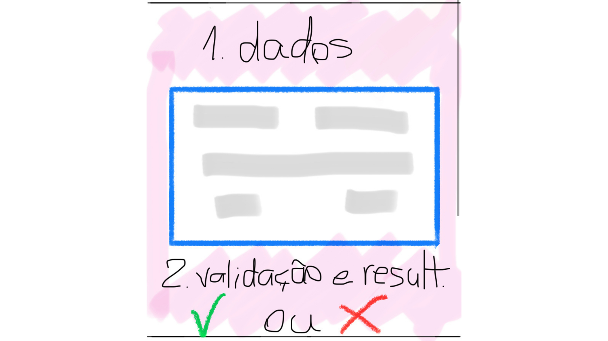
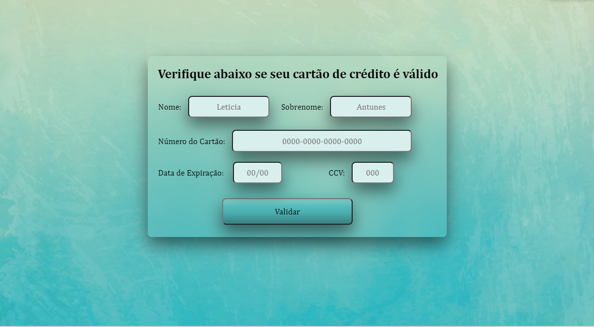
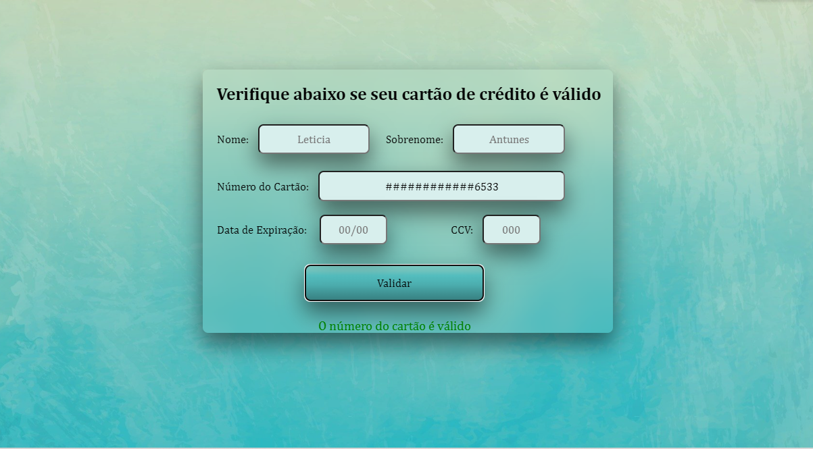

# Card Validation :credit_card:

## Projeto 1 - Card Validation desenvolvido no bootcamp SAP007 Laboratória :yellow_heart:

## Índice

* [1. Sobre o projeto](#dart-sobre-o-projeto)
* [2. Como usar?](#gear-como-usar)
* [3. Protótipo e UX](#computer-protótipo-e-UX)
* [4. Resultados](#%EF%B8%8F-resultados)
* [5. Tecnologias](#robot-tecnologias)
* [6. Sobre a autora](#woman_technologist-sobre-a-autora)

---
## :dart: Sobre o projeto 

O [Card Validation](https://github.com/leticiaantunesjpeg/SAP007-card-validation/) foi desenvolvido com o objetivo de validar números de cartões de crédito e usando o Algoritmo de Luhn.

O [algoritmo de Luhn](https://en.wikipedia.org/wiki/Luhn_algorithm), também
chamado de módulo 10, é um método de soma de verificação, usado para validar
números de identificação, como o IMEI de telefones celulares, cartões de crédito
etc.

Esse algoritmo é simples. Obtemos o inverso do número a ser verificado (que
contém apenas dígitos [0-9]); todos os números que ocupam uma posição par devem
ser multiplicados por dois; se esse número for maior ou igual a 10, devemos
adicionar os dígitos do resultado; o número a verificar será válido se a soma de
seus dígitos finais for um múltiplo de 10.

Durante o desenvolvimento do projeto, me preocupei na elaboração de um código limpo, de fácil entendimento. O primeiro projeto da Laboratoria contribuiu com meu aprendizado sobre HTML semântico, gerenciamento de eventos de DOM, tipos de dados primitivos, uso de condicionais, loops, funções e UX, etc.

---
## :gear: Como usar?
Para usar o Card Validation, basta inserir o número do cartão a ser validado no campo "0000-0000-0000-0000", clicar em validar e esperar pela resposta logo abaixo do botão. Caso seja positiva, o usuário receberá a mensagem "O número do cartão é válido" em verde, do contrário, receberá a mensagem "O número do cartão é inválido, revise-o".

Números de cartão de crédito disponíveis para teste:

| Bandeiras   | Números Válidos      |
| :---------- | :------------------- |
| Visa        | 4916515890086533     |
| AMEX        | 374287609161667      |
| MasterCard  | 5485755481460022     |

---
## :computer: Protótipo e UX

O protótipo do projeto foi elaborado com a finalidade de manter o usuário em apenas uma página e retornar as informações requisitadas de forma simples e de fácil entendimento. No exemplo do protótipo, há um símbolo :white_check_mark: a ser retornado caso o número do cartão seja válido, e um símbolo :x: caso seja inválido, que foram substituídos com a mensagem em verde ou vermelho.

O fluxo do usuário é ler a header com a mensagem: "Verifique abaixo se seu cartão de crédito é válido", inserir as informações de pagamento nos inputs e em seguida clicar no botão "validar" em gradiente azul piscina em destaque abaixo. Após o envio das informações, o usuário recebe a mensagem de acordo com as infomações enviadas.

## ✔️ Resultados

---
## :robot: Tecnologias Utilizadas

- HTML 5
- CSS3
- JavaScript
- Node.js

---
## :woman_technologist: Sobre a autora
### Leticia Antunes Almeida

- [LinkedIn](https://www.linkedin.com/in/leticiaantunes95/)
- E-mail: leticiaantunes227@gmail.com